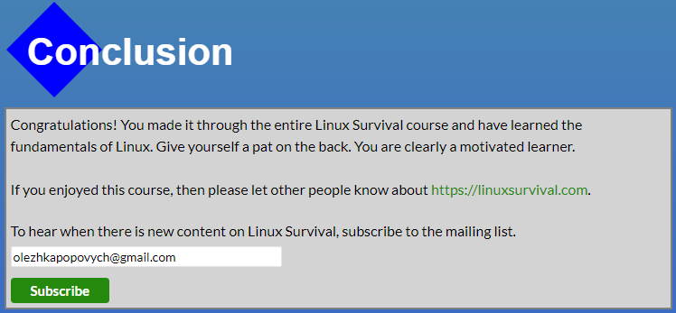

## Git та GitHub.
Більшість матеріалу була для мене новою. Досі я кілька разів _комітив_ у віддалений репозиторій під час проходження он-лайн занять. Новим для мене став також `Markdown`, ніколи цей вид розмітки мені не траплявся, але думаю з ним проблем не буде :). 

**Git** дає розробникам надзвичайні можливості та дозволяє злагодити процес розробки. Я вже зараз здивований більшою частиною його можливостей про які дізнався, але підозрюю їх є ще дуже багато, чого вартий тільки `pull-request!`.

Варіації коман по релокації комітів мені ще доведеться пізнати краще, проте вже зараз я використовую команди `checkout, branch, merge, pull, push` під час роботи з проектом. 

## Linux, Command Line, HTTP Tools

**Linux** **Survival**

Тут я нарешті спробував як це користуватись командним рядком не тільки пишучи в ньому команди `git`. З командами копіювання та переміщея файлів доведеться ще попрацювати, але переміщення та створення нових каталогів з файлами мені вже вдається! Користуватимусь Git Bash та терміналом в VSC.

**HTTP**

У прочитаних статтях дуже багато нової для мене інформації, не всю її можу зрозуміти. Раніше вже стикався з XML, feth запитами під час навчання. Ймовірно найближчим часом мені дотведеться працювати з тілом об'єкта відповіді.

